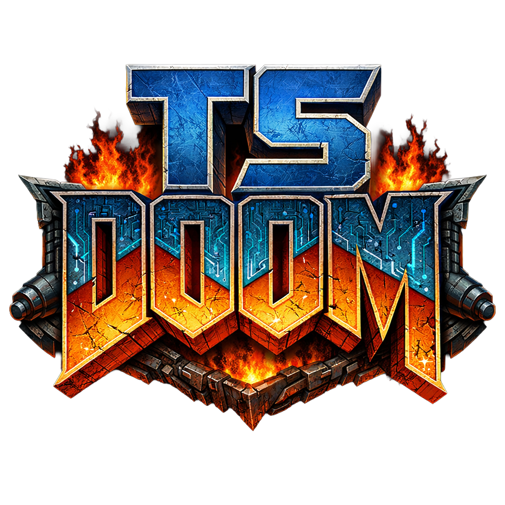

🌐 _[English](../README.md) | [Русский](README.ru.md) | [中文](README.zh.md) | [日本語](README.ja.md) | Español_

Un motor de DOOM escrito desde cero íntegramente en **TypeScript**, ejecutándose en el navegador a través de un `<canvas>` HTML5. Sin WebGL, sin frameworks — renderizado por software puro, como en 1993.

TSDoom carga el **DOOM1.WAD** original y recrea fielmente el clásico motor id Tech 1: renderizado BSP, iluminación por sectores, texturas animadas, armas hitscan, puertas, ascensores, aplastadores, recolección de objetos y mucho más.

## 🚀 Inicio rápido

### Requisitos previos

- [Node.js](https://nodejs.org/) (v18+)
- Una copia de `DOOM1.WAD` (el WAD shareware del DOOM original)

### Instalación

```bash
# Clonar el repositorio
git clone https://github.com/your-username/TSDoom.git
cd TSDoom

# Instalar dependencias
npm install

# Colocar el archivo WAD
# Copiar DOOM1.WAD en el directorio data/
cp /path/to/DOOM1.WAD data/

# Iniciar el servidor de desarrollo
npm run dev
```

Abre [http://localhost:5173](http://localhost:5173) en tu navegador y juega.

### Compilación para producción

```bash
npm run build
npm run preview
```

## 🎮 Controles

| Acción                     | Tecla                     |
| -------------------------- | ------------------------- |
| Avanzar                    | `W`                       |
| Retroceder                 | `S`                       |
| Desplazarse a la izquierda | `A`                       |
| Desplazarse a la derecha   | `D`                       |
| Girar / Apuntar            | Ratón                     |
| Disparar                   | Botón izquierdo del ratón |
| Usar / Abrir               | `E` o `Space`             |
| Correr                     | `Shift`                   |
| Selección de arma          | `1`–`7`                   |
| Menú / Pausa               | `Escape`                  |
| Ayuda                      | `F1`                      |

> Haz clic en el canvas para capturar el puntero del ratón (bloqueo de puntero).

## 🔧 Stack tecnológico

| Componente   | Tecnología                              |
| ------------ | --------------------------------------- |
| Lenguaje     | TypeScript                              |
| Empaquetador | Vite                                    |
| Renderizado  | HTML5 Canvas 2D (renderizador software) |
| Objetivo     | ES2024                                  |

**Cero dependencias en tiempo de ejecución.** El motor completo está construido desde cero, utilizando únicamente TypeScript y Vite como dependencias de desarrollo.

## 📖 Referencias

La implementación del motor sigue de cerca el código fuente original de DOOM:

- [Código fuente de DOOM de id Software](https://github.com/id-Software/DOOM) — la base de código original en C
- [Unofficial DOOM Specs](https://doomwiki.org/wiki/Unofficial_Doom_Specs) — formato WAD y estructuras de datos
- [DOOM Wiki](https://doomwiki.org/) — referencia exhaustiva sobre todo lo relacionado con DOOM
- [Game Engine Black Book: DOOM (Fabien Sanglard)](https://fabiensanglard.net/gebbdoom/) — análisis detallado del motor

## ⚖️ Aviso legal

DOOM es una marca registrada de id Software / ZeniMax Media / Microsoft. Este proyecto es una reimplementación independiente y educativa del motor y **no** incluye ningún dato de juego protegido por derechos de autor. Debes proporcionar tu propio archivo `DOOM1.WAD`.

## 📄 Licencia

Este proyecto se proporciona tal cual con fines educativos.
